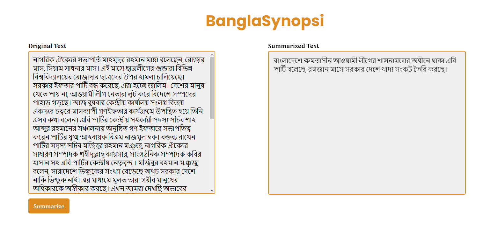

# Bangla News Article Summarization API using FastAPI



This project implements an API for summarizing Bangla news articles using FastAPI and Hugging Face Transformers. It provides a simple and efficient way to summarize Bangla text content programmatically.

## Features

- Summarize Bangla news articles into concise summaries.
- Utilizes pre-trained models from Hugging Face Transformers for efficient text summarization.
- FastAPI for creating RESTful APIs with minimal code.

## Installation

1. Clone the repository:

   ```bash
   git clone https://github.com/your-username/Bangla-News-Article-Summarization-API-using-FastAPI.git
   
2. Navigate to the project directory:
  ``` cd Bangla-News-Article-Summarization-API-using-FastAPI

4. Install the required dependencies:
5. Run the FastAPI server:
